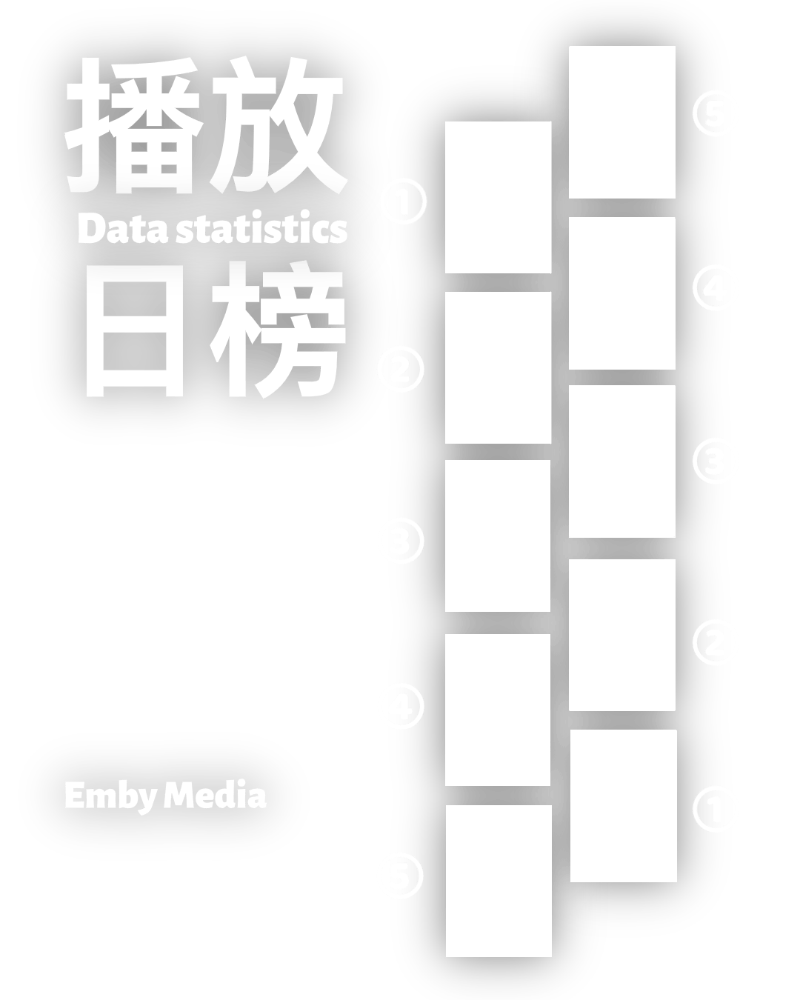

# 📊 Emby-Ranks (Emby 媒体播放与观影时长榜单推送)

<p align="center">
  
</p>

`Emby-Ranks` 是一个轻量、专注且功能完善的 Emby 媒体服务器榜单与观影数据统计推送工具。从 `Sakura_embyboss` 抽离重构，去除了繁琐的开服管理和数据库依赖，专注于**自动化榜单渲染**与**多渠道推送**。

支持 **x86_64 (amd64)** 与 **ARM64** 双架构 Docker 镜像，并配置了 GitHub Actions 自动化构建发布流水线。

---

## ✨ 核心特性

- 🖥️ **现代化 Web 可视化控制台**：
  - **📊 监控大屏**：实时展示 Emby 在线人数、正在播放影片卡片流、今日/本周热门排行榜。
  - **🎨 海报工坊**：在线一键实时渲染与即时预览日榜/周榜高清海报，支持横/竖版切换、自定义用户榜单封面图与一键下载。
  - **⚙️ 可视化配置中心**：网页端直观修改 Emby 连接与 API、一键测试连接、可视化 Cron 调度开关、Telegram/Discord/Webhook 测试推送。
  - **⚡ 实时热重载**：网页端保存配置后自动热重载生效，无需重启容器！
- 🎬 **媒体播放日榜 (`dayrank`)**：每日定时统计电影与电视剧播放次数与时长 Top 10，自动合成精美高清海报图文推送。
- 🏆 **媒体播放周榜 (`weekrank`)**：每周定时汇总全服最热播放榜单，生成周榜专属海报。
- 🥇 **用户时长日榜 / 周榜 (`dayplayrank` / `weekplayrank`)**：统计全服用户观看时长排名，奖牌与时长中文排版。
- 📊 **实时会话状态 (`watching`)**：查看当前在线人数、正在播放影片与播放进度。
- 🤖 **Telegram 智能交互机器人**：
  - **📱 官方快捷菜单**：自动注册左下角【菜单】快捷面板，支持一键触发命令。
  - **🔢 智能按键翻页**：榜单消息附带动态数字翻页与一键关闭按键。
  - **🛡️ 权限与防刷限流**：支持群聊仅管理员触发、群聊防刷冷却（默认 15s）、私聊 User ID 授权白名单。
- 🎨 **Pillow 高性能海报引擎**：支持随机背景、预设遮罩、封面并发拉取、横版/竖版封面自适应与自定义字体。
- 📢 **多通知渠道**：
  - **Telegram**：支持海报图文发送、超长文本智能分段、最新榜单**自动置顶**并自动取消上期置顶。
  - **Discord**：支持 Webhook 发送。
  - **通用 Webhook**：支持接入企业微信机器人、Bark、PushPlus 等。
- 🐳 **双架构 Docker 镜像**：无缝运行在 x86 VPS、群晖/威联通 NAS、树莓派或 ARM 服务器上。
- 🚀 **GitHub Actions CI/CD**：推送 Git Tag 即可全自动构建并发布多架构镜像至 Docker Hub。

---

## 🤖 Telegram 机器人交互指令

机器人启动后可直接在 Telegram 私聊或群组中发送以下指令实时查询：

| 快捷命令 | 完整命令 / 别名 | 功能说明 | 呈现形式 |
| :--- | :--- | :--- | :--- |
| `/now` | `/status`, `/playing` | 查询当前 Emby 在线人数与正在播放的影片列表 | 纯文本消息 |
| `/drank` | `/day_rank`, `/day` | 实时生成并发送 **24 小时播放日榜高清海报** | 海报图片 + 文本榜单 |
| `/wrank` | `/week_rank`, `/week` | 实时生成并发送 **本周热门播放周榜高清海报** | 海报图片 + 文本榜单 |
| `/urank [天数]` | `/uplays [天数]` | 实时生成 **用户播放时长统计榜**（默认 7 天，支持如 `/urank 30`） | 专属封面图 + 动态翻页按键 |
| `/help` | `/start` | 调出机器人指令帮助中心与快捷入口 | 交互菜单 |

---

## 🛠️ 前置要求

1. **Emby Server 端**：必须安装 **Playback Reporting** 插件（Emby 官方插件库中即可搜索安装），统计查询依赖此插件。
2. Emby API Key（在 Emby 后台「设置」->「API 密钥」中生成）。

---

## 🚀 快速开始

### 方式一：Docker Compose 部署（推荐）

1. 创建工作目录并下载配置文件模板：
```bash
mkdir emby-ranks && cd emby-ranks
mkdir -p config data
# 将 config.example.yaml 复制为 config/config.yaml 并修改
```

2. 编写 `docker-compose.yml`：
```yaml
version: '3.8'

services:
  emby-ranks:
    image: listeningltg/emby-ranks:latest
    container_name: emby-ranks
    restart: unless-stopped
    ports:
      - "8000:8000"
    environment:
      - TZ=Asia/Shanghai
    volumes:
      - ./config:/app/config
      - ./data:/app/data
      # 可选：自定义海报字体或背景遮罩
      # - ./assets:/app/assets
```

3. 启动服务并在浏览器访问 `http://你的IP:8000`：
```bash
docker compose up -d
```

---

### 方式二：直接通过环境变量运行 Docker

无需挂载配置文件，直接传参启动：
```bash
docker run -d \
  --name emby-ranks \
  --restart unless-stopped \
  -e TZ=Asia/Shanghai \
  -e EMBY_URL="http://192.168.1.100:8096" \
  -e EMBY_API_KEY="your_api_key" \
  -e EMBY_SERVER_NAME="MY EMBY" \
  -e TELEGRAM_BOT_TOKEN="123456:ABC..." \
  -e TELEGRAM_CHAT_ID="-100123456789" \
  -v $(pwd)/data:/app/data \
  listeningltg/emby-ranks:latest
```

---

### 方式三：本地 Python 运行

```bash
# 1. 克隆仓库与安装依赖
git clone https://github.com/your_username/emby-ranks.git
cd emby-ranks
pip install -r requirements.txt

# 2. 复制并编辑配置
cp config/config.example.yaml config/config.yaml

# 3. 守护进程模式启动 (按配置的 Cron 定时执行)
python main.py --daemon

# 4. 手动单次测试运行
python main.py --run day_rank --save-poster test_day.jpg
python main.py --run week_rank
python main.py --run week_play_rank
python main.py --run watching
```

---

## ⚙️ 配置文件说明 (`config/config.yaml`)

```yaml
timezone: "Asia/Shanghai"

emby:
  url: "http://192.168.1.100:8096"
  api_key: "your_emby_api_key_here"
  server_name: "MY EMBY"   # 海报和标题显示的 Logo

poster:
  use_backdrop: false            # true: 使用横版剧照; false: 使用竖版海报
  top_limit: 10                  # 统计 Top N
  assets_dir: "./assets"         # 素材目录
  user_rank_image: ""            # 用户时长榜专属封面图路径/URL (可选)

schedules:
  day_rank:
    enabled: true
    cron: "30 18 * * *"          # 每天 18:30 媒体播放日榜
    pin_message: true            # 是否自动置顶
  week_rank:
    enabled: true
    cron: "59 23 * * 0"          # 每周日 23:59 媒体播放周榜
    pin_message: true
  day_play_rank:
    enabled: false
    cron: "00 23 * * *"          # 用户时长日榜
    pin_message: false
  week_play_rank:
    enabled: true
    cron: "00 23 * * 0"          # 每周日 23:00 用户时长周榜
    pin_message: false

notifiers:
  telegram:
    enabled: true
    bot_token: "123456:ABC..."
    chat_id: "-100123456789"
    pin_message: true
    proxy: ""                    # 可选代理，如 "http://127.0.0.1:7890"
    admin_only: false            # true: 仅管理员可在群内触发命令; false: 允许所有人触发
    cooldown_seconds: 15         # 群聊命令防刷冷却时间 (秒)
    whitelist_user_ids: ""       # 私聊授权白名单 User ID (逗号分隔，留空表示允许所有人私聊)

  discord:
    enabled: false
    webhook_url: ""

  webhook:
    enabled: false
    url: ""
```

---

## 🚢 GitHub Actions 自动构建与发布 Docker 镜像

项目内置了完整的跨平台发布流水线 [`.github/workflows/docker-publish.yml`](.github/workflows/docker-publish.yml)。

### 配置步骤：
1. 将项目推送到 GitHub 仓库。
2. 打开 GitHub 仓库页面 -> **Settings** -> **Secrets and variables** -> **Actions** -> 点击 **New repository secret**：
   - `DOCKERHUB_USERNAME`: 你的 Docker Hub 用户名
   - `DOCKERHUB_TOKEN`: 你的 Docker Hub Access Token
3. **发布版本**：只需要打上 `v*` 格式标签并推送：
```bash
git tag v1.0.0
git push origin v1.0.0
```
GitHub Actions 会自动触发构建 `linux/amd64` 和 `linux/arm64` 镜像，并自动打上 `latest` 与 `1.0.0` 标签发布到 Docker Hub！

---

## 📜 鸣谢
- 感谢 [Sakura_embyboss](https://github.com/berry8838/Sakura_embyboss) 的设计灵感与海报模板。
- 感谢 [Emby Playback Reporting](https://github.com/MediaBrowser/Emby.Plugins) 提供的统计接口支持。